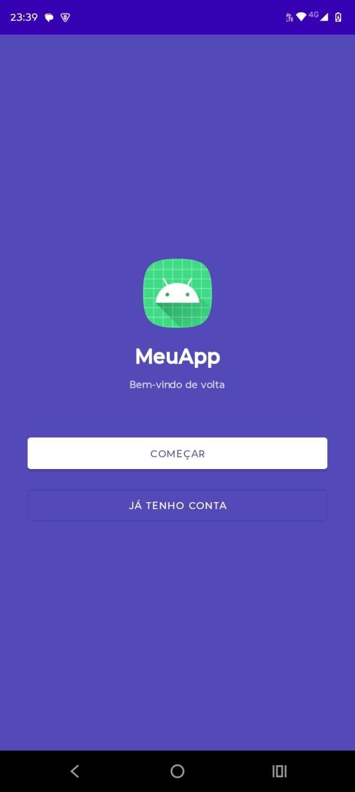
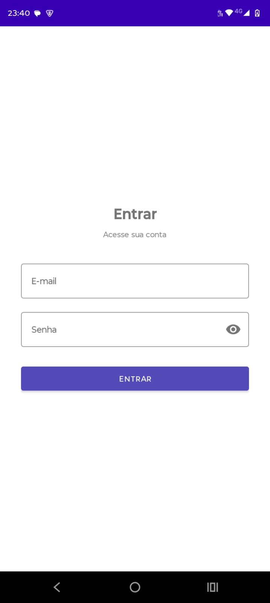
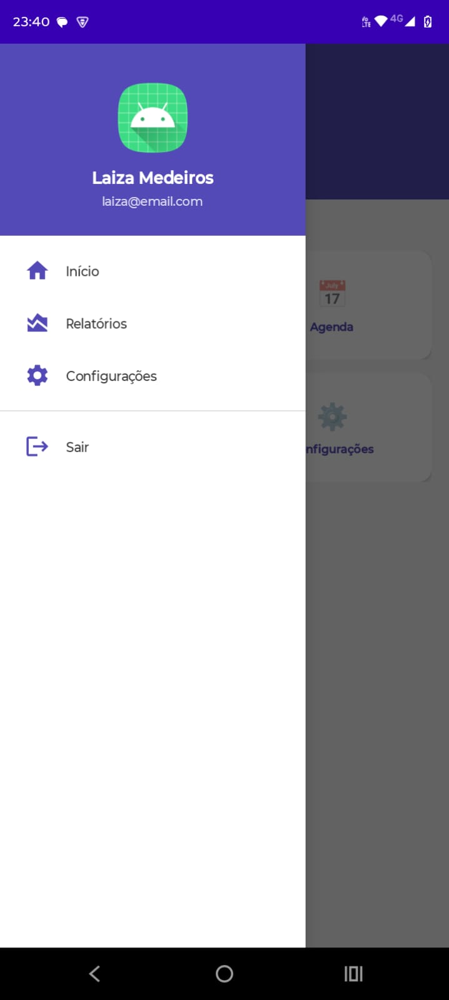

## Disciplina: [2026] Programação para Dispositivos Móveis

Integrantes do grupo:
- Thifany Rachel da Cunha Raitz
- Laiza Medeiros Ribeiro
- Luiz Fernando Corrêa Rodrigues

## ✅ Resultado do projeto

<h1 align="center">
  
  
  
  
</h1>
